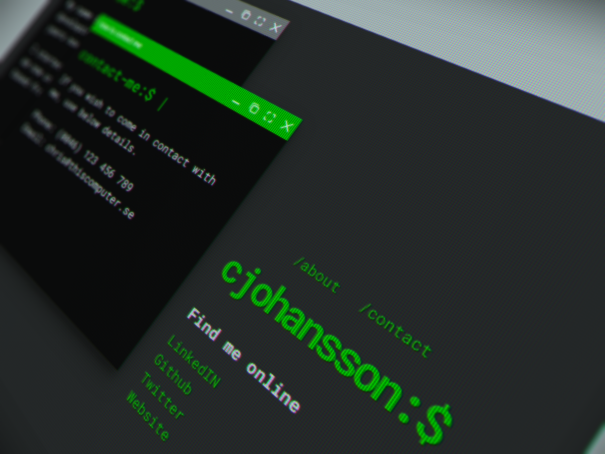

# Terminal Web

This is a small terminal themed website built on top of WinBox.js to demonstrate its features.

This basic structure may be used as base for other ideas and concepts. You can click about and contact links, they will open as windows within the browser. This is how WinBoxJS works.

## About Winbox.js

WinBox is a modern HTML5 window manager for the web. Lightweight, outstanding performance, no dependencies, fully customizable and most important of all, it is open source and free for all.

Visit their site at [WinBox.js](https://nextapps-de.github.io/winbox/)